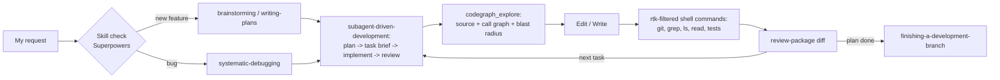

I use Claude Code as my main coding assistant every day, across a backend, a web frontend, and two React Native mobile apps. Over the last couple of months I've layered three things on top of the default setup that changed how I actually work with it: a small CLI proxy that cuts token usage on routine commands, a skills framework called Superpowers that gives the agent a repeatable process instead of winging it every time, and a code graph tool that replaces a lot of grep-and-read exploration with one query.

None of these are required to use Claude Code well. But together they turned a lot of "let me grep around and re-read three files" into "here's the answer, with the call graph attached." Here's what each one does and why I added it.

## The problem: plain commands burn tokens for no reason

Claude Code runs real shell commands like `git status`, `ls`, `grep`, `cat`. Fine for a human terminal, but every line of that output goes back into the model's context as tokens. A `git status -uall` on a big repo, a `grep -r` that matches in fifty files, a full `cat` of a 2000 line file when you only needed ten lines near the top: all of that is context you're paying for and the model has to read through.

I installed a small Rust CLI called **rtk** (I call it "Rust Token Killer" for short) that sits in front of common commands and returns a filtered, compact version of the same information. It's wired in through a Claude Code hook, so it's mostly invisible: when the agent runs `git status`, the hook rewrites it to `rtk git status` before it executes, and the output comes back trimmed. No prompt changes needed on my end.

Pulling my own numbers with `rtk gain`:

| Metric                                     | Value |
| ------------------------------------------ | ----- |
| Commands run through rtk                   | 1,657 |
| Raw input tokens (what it would have cost) | 2.5M  |
| Tokens actually saved                      | 1.9M  |
| Average savings                            | 79.2% |

The savings aren't evenly spread. Reading files is the single biggest win in raw token count, because most of the time the agent only needs a slice of a file, not the whole thing. Process listings (`ps aux`) are the biggest *percentage* win, close to 98%, because almost nothing in a full process table is relevant and the filtered version strips it down to the one or two rows that matter. Grep and directory listings save a smaller percentage per call, but they run constantly, so the volume adds up.

The part I like most: this needed zero changes to how I prompt the agent. It runs `git status` like normal, the hook quietly turns it into `rtk git status`, and the savings just happen.

## The problem: an agent without a process repeats your mistakes

A model that just reacts to whatever you type will happily start writing code before it understands the requirement, skip tests, and call a bug "fixed" the moment the code compiles. What I actually want is closer to how a good engineer works: clarify the requirement, write a plan, implement it task by task, get it reviewed, then merge.

**Superpowers** is a Claude Code plugin that packages this as a set of skills the agent is instructed to check before doing almost anything. The framework itself is one meta-skill that says, roughly: before you respond to any request, check whether one of these skills applies, and if it does, you don't get to skip it. On top of that sit skills for specific situations:

| Skill                                          | When it kicks in                                                                     |
| ---------------------------------------------- | ------------------------------------------------------------------------------------ |
| brainstorming                                  | Before any new feature or behavior change, to pin down intent and design before code |
| systematic-debugging                           | Before proposing a fix for any bug or test failure                                   |
| writing-plans                                  | Once requirements are clear, to turn them into a concrete step-by-step plan          |
| test-driven-development                        | Before writing implementation code for a feature or fix                              |
| subagent-driven-development                    | To execute a plan's tasks one at a time, each in its own reviewed unit               |
| requesting-code-review / receiving-code-review | Before merging, and when incorporating feedback without just agreeing to everything  |
| finishing-a-development-branch                 | Once a plan's implementation is done and tests pass, to decide how to merge it       |
| using-git-worktrees                            | To isolate feature work from whatever else is going on in the working tree           |
| verification-before-completion                 | Before claiming anything is "done", "fixed", or "passing"                            |

The one I use the most in practice is `subagent-driven-development`. In real use it looks like this: I write (or the agent writes, with me reviewing) a plan file as markdown, with a goal, an architecture note, and a numbered list of tasks, each with its own checkbox, files to touch, and a quality gate (typecheck, lint, tests). Then a small script sets up an isolated workspace for that plan, another script pulls out a single task as a self-contained brief for a subagent to implement, and a third script packages up the diff between two git commits for review before moving to the next task. It's the same rhythm every time: plan, brief, implement, review, next task. That repeatability is the actual value. It's not that the model got smarter, it's that it stopped improvising its process.

## The problem: understanding a codebase by grepping it

Before codegraph, answering "what calls this function, and what breaks if I change it" meant a round of grep to find call sites, then reading each matching file, then maybe grepping again for something the first pass missed. For anything non-trivial that's easily five or ten tool calls before you actually have an answer.

**Codegraph** runs as a local MCP server backed by a SQLite database that indexes every symbol, file, and edge (calls, imports, JSX usage) in the workspace. A file watcher keeps it in sync with about a one second lag after you save. It exposes one tool, and it answers a question like "how does the branch list screen load its data" or "what happens if I change this function's signature" in a single call: verbatim source, line-numbered so it's safe to edit from directly, plus who calls it and what depends on it, including the kind of dynamic hops (callbacks, re-renders, JSX children passed as props) that plain grep can't follow at all.

The practical effect is fewer round trips per question, and answers that come with the blast radius already attached instead of having to reconstruct it by hand across several files.

## How it fits together

None of these three pieces depend on each other. rtk works with a plain unmodified Claude Code. Superpowers doesn't care whether codegraph is installed. Codegraph is just an MCP server. But stacked together, the loop looks like: skill decides the process, codegraph answers "what's here and what depends on it" in one shot instead of many, the plan gets executed one reviewed task at a time, and every shell command along the way comes back trimmed instead of dumping raw output into context.

A few honest caveats if you're thinking about trying any of this:

- rtk has a naming collision with an unrelated tool also called `rtk` (Rust Type Kit), so `which rtk` is worth checking after install.
- The skill-check-before-everything behavior in Superpowers is deliberately strict. It occasionally invokes a process skill for something that really was a one-line answer. I'd rather have that than the alternative.
- Codegraph's index lags real edits by about a second, so right after a large refactor it's worth a beat before trusting a query against files you just changed.

I didn't build any of these three tools myself. rtk and codegraph are both separate CLIs I installed and wired in, and Superpowers is a plugin from the `obra/superpowers-marketplace` repo. What I did was put them together into a setup that actually changed my day to day workflow, and the numbers above are pulled straight from my own usage, not a marketing page.
