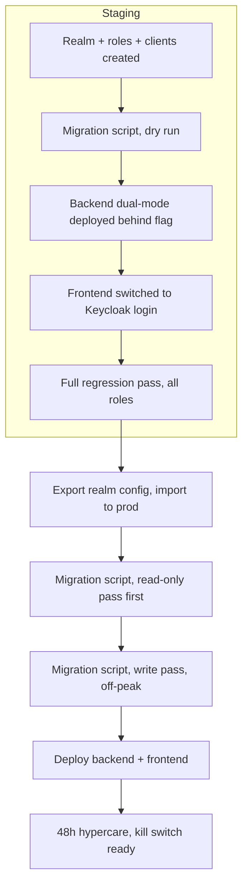

Our platform is a fairly typical setup: a Node/Express backend, a React web frontend, and two React Native mobile apps (driver and verifier apps), all sharing one Postgres database of users. Login had been homegrown from day one: a `/login` endpoint checks a bcrypt hash, signs a JWT with a shared secret, and every request after that gets verified against that same secret. It worked, but it had three real problems.

There was no self-service password reset. If someone forgot their password, an admin had to reset it manually. The login screens were hand-built React forms, duplicated (slightly differently) across web and both mobile apps. And there was no path to anything like single sign-on or social login without rebuilding all of that by hand.

The fix was to move authentication to Keycloak, an open source identity server. This post is about how we did the web + backend cutover specifically: what the design constraint was, how we handled the transition without a big-bang rewrite, and the handful of bugs that only showed up once we actually tested with a browser and a real login, not by reading the code.

## The one rule we set before writing any code

Everywhere downstream of login, the code assumes a fixed shape: once a token is verified, the request gets a `req.headers.User` object, which is the full user row from the database, role included. Every access-control check, every controller, everything reads that same shape today. Rewriting all of that at the same time as switching identity providers would have turned a contained auth change into a rewrite of the entire app.

So we made a rule and stuck to it: we only change *how the incoming token gets verified* and *how we figure out which user it belongs to*. Nothing downstream of that changes at all.

## Dual-mode verification, not a big switch

Mobile apps weren't cutting over yet, which meant the backend had to accept both the old tokens and the new Keycloak tokens at the same time, for different clients, indefinitely, until mobile caught up. Feature-flagging the whole thing off and on wasn't good enough, because both kinds of tokens needed to keep working simultaneously.

The two token types turned out to have a clean, free discriminator. Keycloak issues RS256-signed tokens with a `kid` (key ID) header pointing at the realm's public key set (JWKS). Our old tokens are HS256, signed with a private shared secret, no `kid` at all. So the middleware just looks at the token's header:

```js
const header = jwt.decode(bearerToken, { complete: true })?.header;

if (header?.alg === 'RS256' && header?.kid) {
  // Keycloak-issued token: verify against the realm's JWKS
  const decoded = await verifyKeycloakJWT(bearerToken);
  // a custom claim maps straight back to our existing user id
  id = decoded.legacy_user_id;
} else {
  // old token, verified the same way as always
  ({ id } = verifyOldJWT(bearerToken));
}
// from here on, nothing changes: same DB lookup, same req.headers.User shape
```

That `legacy_user_id` claim is the key piece. We added a Keycloak protocol mapper that stamps a custom user attribute into every access token, set during migration to the user's existing database id. So a Keycloak token maps straight back to the same row the old token would have, no lookup-by-email guessing required. And because the check is based on token *shape*, not which app requested it, the same code handles web and mobile the moment mobile starts sending Keycloak tokens too. No branching needed later, per app.

We also kept an env var kill switch around the whole Keycloak branch, defaulting to on. Not because the rollout itself needed gating (dual-mode already handles that safely, per request), but as an instant rollback lever if something went wrong in production, without needing a redeploy.

## Roles and clients

We mapped our existing role enum onto Keycloak realm roles one to one:

| Existing role      | Keycloak realm role |
| ------------------ | ------------------- |
| Driver             | DRIVER              |
| Company admin      | COMPANY_ADMIN       |
| Restaurant admin   | RESTAURANT_ADMIN    |
| Branch admin       | BRANCH_ADMIN        |
| Verifier/inspector | VERIFIER            |
| Platform admin     | ADMIN               |

And registered three clients: a confidential, bearer-only client for the backend (it never starts a login flow itself), and a public PKCE client for the web app. Two more PKCE clients for the mobile apps got registered ahead of time even though the mobile cutover itself was scoped for later, since setting up the realm-side pieces cost nothing extra and let us verify end to end that the backend could already accept mobile tokens whenever the apps were ready.

## Migrating users without real emails

Here's the wrinkle that took the longest to get right. Our `email_address` column is nullable, and for most existing users it doesn't hold a real email at all. It holds a "user code" formatted to look email-shaped, something like `driver12@driver12`, one `@`, no dot in the domain. The login endpoint already had logic to detect this pattern.

That matters a lot for Keycloak, because Keycloak's own username/email fields are meant to be real and unique, and "Forgot password" only works if the email field holds something that can actually receive mail. So the migration script had to:

- Always set Keycloak's `username` to our existing user code (never the email-looking field).
- Only set Keycloak's `email` when the value genuinely looks like an email, leaving it blank otherwise.
- Keep the migration idempotent (keyed by that same `legacy_user_id` attribute), so re-running it updates existing accounts instead of duplicating them.
- Set `enabled: false` in Keycloak for any user already blocked in our system, so a blocked user can't complete a Keycloak login and password reset before our own access-control check catches up. Not a security hole either way, since that check still runs downstream, but it's confusing if the two systems disagree about who's blocked.

We initially planned to force everyone onto a fresh password on first login, since there's no way to carry a bcrypt hash into Keycloak's own user-creation API directly. The business decided against that midway through: existing passwords should just keep working. Keycloak doesn't support bcrypt out of the box, so we vendored an open source bcrypt provider (`keycloak-bcrypt`, baked into a custom Keycloak Docker image) and verified it properly before trusting it: a real bcrypt hash logs in correctly, a wrong password gets rejected, and after that first successful login Keycloak quietly rehashes the credential to its own native algorithm. It's a one-time bridge, not a permanent dependency.

## Bugs you only find by actually logging in

Reading the code and the Keycloak docs got us most of the way. But a handful of real problems only turned up once we tried logging in for real, with a browser, past what "looks correct" on paper:

| What we saw                                                                                            | What was actually wrong                                                                                                                                                                    |
| ------------------------------------------------------------------------------------------------------ | ------------------------------------------------------------------------------------------------------------------------------------------------------------------------------------------ |
| Every real Keycloak-issued request silently fell through to the legacy branch and failed               | `jwt.decode()` returns nothing useful if the token string still has `"Bearer "` on the front, and every real HTTP client sends the header exactly that way                             |
| Every Keycloak login failed one specific downstream check                                              | That check needs a session row that our old`/login` endpoint used to create; Keycloak logins never went through that endpoint, so we had to bootstrap a session row on first use instead |
| A protocol mapper looked completely correctly configured but the claim never showed up in a real token | The "Token Claim Name" field was left blank; everything else about the mapper can be right and it still emits nothing without that one field set                                           |
| Every login showed an unexpected "update your account info" screen                                     | Keycloak's default user profile marks email/first name/last name as required, and most migrated users don't have those; had to turn that requirement off                                   |
| Logging out didn't actually log you out; the very next page load silently signed you back in           | Several separate layout/header components each had their own copy-pasted logout handler, and none of them called Keycloak's own logout, so its session cookie just stayed alive            |
| The "reset password" link went to a broken page, twice                                                 | The right path for the hosted account console isn't hash-based routing like our own app; it's a real path, and even the corrected version needed a second look before it actually worked   |
| The custom login page didn't match our old page's look, even after we added our own theme CSS          | The background didn't come from the selector we assumed; it came from a bundled default stylesheet targeting a different CSS selector than the one we'd overridden                         |

None of these are exotic. Each one is the kind of thing that looks completely fine in a code review and only breaks in a real browser, with a real token, on a real page. That's really the headline lesson from the whole project: verify with an actual login, not by reading the code and assuming it's right.

## Rollout



We did staging fully end to end before touching production: infra and realm setup first, then the backend's dual-mode branch, then the frontend swap, then a full manual regression pass across every role. Production followed the same order, with the user migration split into a read-only "here's what would happen" pass first (so anomalies like duplicate or missing emails get resolved by a human before anything is written) and a separate write pass afterward.

Mobile apps were explicitly deferred to a later sprint. The backend was ready for them (we tested it with real tokens from both mobile clients ahead of schedule, and it worked without a single code change, since the dual-mode check never cared which client sent the token). What was still genuinely unstarted was the mobile app codebases themselves adopting a proper OAuth login flow, which is a real chunk of work on its own given how mobile apps handle token refresh while offline.

## What I'd repeat next time

Draw the line around what you're allowed to touch before you write any code, and hold it. Ours was "only change how a token gets verified", and it's the reason this didn't spiral into a rewrite of the whole access-control layer.

Pick a discriminator that's free. Token shape (algorithm plus presence of a key ID) cost us nothing to check and needed zero coordination with the apps that already send tokens correctly.

Keep an instant, no-deploy rollback lever for the exact thing you're least sure about, even if you don't expect to need it.

And budget real time for hands-on testing after the code is "done." Every genuinely tricky bug in this project came from actually logging in, not from reading the code twice.
